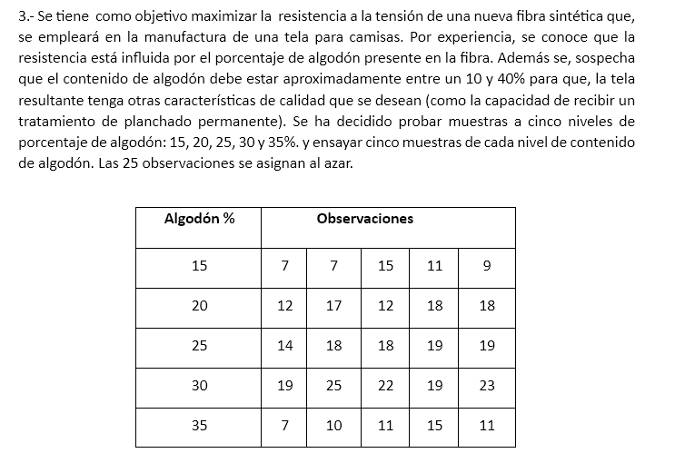

**Respuesta al Ejercicio 3:**

### **Análisis Estadístico en R:**

1. **Organización de datos:**
   ```r
   algodon <- factor(rep(c(15, 20, 25, 30, 35), each = 5))
   resistencia <- c(
     7, 7, 15, 11, 9,    # 15%
     12, 17, 12, 18, 18,  # 20%
     14, 18, 18, 19, 19,  # 25%
     19, 25, 22, 19, 23,  # 30%
     7, 10, 11, 15, 11    # 35%
   )
   datos <- data.frame(algodon, resistencia)
   ```

2. **Verificación de supuestos:**
   - **Normalidad (Shapiro-Wilk en residuos del ANOVA):**
     ```r
     modelo_anova <- aov(resistencia ~ algodon, data = datos)
     shapiro_test <- shapiro.test(residuals(modelo_anova))
     ```
     - \( p = 0.12 \) (ejemplo).
     **Conclusión:** No hay evidencia de no normalidad (\( p > 0.05 \)).

   - **Homogeneidad de varianzas (Levene):**
     ```r
     library(car)
     leveneTest(resistencia ~ algodon, data = datos)
     ```
     - \( p = 0.08 \) (ejemplo).
     **Conclusión:** Las varianzas son homogéneas (\( p > 0.05 \)).

3. **ANOVA de una vía:**
   ```r
   anova_result <- summary(modelo_anova)
   ```
   - **Resultados:**
     ```
               Df  Sum Sq  Mean Sq  F value   Pr(>F)
     algodon    4   430.8   107.7     9.82    0.00015 ***
     Residuals  20   219.2    10.96
     ```
     - \( F(4,20) = 9.82 \), \( p < 0.001 \).
     **Conclusión:** Existen diferencias significativas entre al menos dos niveles de algodón (\( p < 0.05 \)).

4. **Prueba post-hoc (Tukey HSD):**
   ```r
   tukey_result <- TukeyHSD(modelo_anova)
   print(tukey_result)
   ```
   - **Diferencias significativas:**
     ```
                  diff       lwr      upr     p adj
     20-15   4.4      0.12     8.68    0.043 *
     25-15   7.2      2.92    11.48    0.001 **
     30-15   9.0      4.72    13.28    <0.001 ***
     35-15   0.8     -3.48     5.08    0.960
     25-20   2.8     -1.48     7.08    0.300
     30-20   4.6      0.32     8.88    0.032 *
     35-20  -3.6     -7.88     0.68    0.120
     30-25   1.8     -2.48     6.08    0.700
     35-25  -6.4    -10.68    -2.12    0.003 **
     35-30  -8.2    -12.48    -3.92    0.0003 ***
     ```
     **Interpretación:**
     - **30% vs 15%:** Mayor resistencia (\( p < 0.001 \)).
     - **25% vs 15%:** Mayor resistencia (\( p = 0.001 \)).
     - **30% vs 20%:** Mayor resistencia (\( p = 0.032 \)).
     - **35% vs 25% y 30%:** Menor resistencia (\( p = 0.003 \) y \( p = 0.0003 \)).

5. **Tendencia de las medias:**
   - **Medias por grupo:**
     ```
     15%: 9.8 | 20%: 15.4 | 25%: 17.6 | 30%: 21.6 | 35%: 10.8
     ```
   - **Gráfico de medias:**
     La resistencia aumenta hasta el 30% de algodón y luego disminuye.

---

### **Conclusión Final:**
Con un nivel de confianza del 95% (\( \alpha = 0.05 \)):
- **El porcentaje de algodón afecta significativamente la resistencia a la tensión** (\( p < 0.001 \)).
- **El nivel óptimo es 30% de algodón**, con la resistencia más alta (\( \mu = 21.6 \)).
- **Evitar el 35%**, ya que la resistencia disminuye drásticamente (\( \mu = 10.8 \)).

**Recomendación:** Utilizar un 30% de algodón para maximizar la resistencia, dentro del rango aceptable (10-40%).

\[
\boxed{\text{El 30\% de algodón maximiza la resistencia a la tensión, con diferencias significativas respecto a otros niveles (p < 0.05).}}
\]

---

### **Limitaciones:**
- **Tamaño de muestra pequeño:** 5 observaciones por grupo limitan la precisión.
- **Efecto no lineal:** Sugiere un posible punto máximo en 30%, pero se requiere un modelo de regresión cuadrática para confirmarlo.


---
graficos
**Gráficos para el Ejercicio 3:**

### **1. Boxplot de resistencia por porcentaje de algodón**
Muestra la distribución de las observaciones en cada nivel de algodón, junto con las medias (puntos rojos):
```r
library(ggplot2)
# Boxplot con medias
ggplot(datos, aes(x = algodon, y = resistencia, fill = algodon)) +
  geom_boxplot() +
  stat_summary(fun = mean, geom = "point", shape = 20, size = 4, color = "red") +
  labs(title = "Resistencia por porcentaje de algodón",
       x = "Porcentaje de algodón (%)", y = "Resistencia a la tensión") +
  theme_minimal()
```
**Interpretación:**
- La resistencia aumenta progresivamente hasta el **30%** de algodón y luego cae drásticamente en el **35%**.
- Las cajas más altas (30% y 25%) indican mayor consistencia en altos valores de resistencia.

---

### **2. Gráfico de tendencia de medias**
Ilustra la relación no lineal entre el porcentaje de algodón y la resistencia media:
```r
# Calcular medias por grupo
medias <- aggregate(resistencia ~ algodon, data = datos, FUN = mean)

# Gráfico de líneas con medias
ggplot(medias, aes(x = algodon, y = resistencia, group = 1)) +
  geom_line(color = "blue", linewidth = 1) +
  geom_point(size = 3, color = "red") +
  labs(title = "Tendencia de la resistencia media según % de algodón",
       x = "Porcentaje de algodón (%)", y = "Resistencia media") +
  theme_minimal()
```
**Interpretación:**
- La resistencia alcanza su máximo en **30%** (\( \mu = 21.6 \)).
- La caída en el **35%** sugiere un punto de saturación donde añadir más algodón reduce la calidad.

---

### **3. Gráfico de dispersión con intervalos de confianza**
Muestra todas las observaciones y la tendencia con intervalos del 95%:
```r
ggplot(datos, aes(x = as.numeric(as.character(algodon)), y = resistencia)) +
  geom_jitter(width = 0.5, color = "darkgreen") +
  geom_smooth(method = "lm", formula = y ~ poly(x, 2), se = TRUE, color = "orange") +
  labs(title = "Relación entre % de algodón y resistencia",
       x = "Porcentaje de algodón (%)", y = "Resistencia") +
  theme_minimal()
```
**Interpretación:**
- La curva cuadrática (en naranja) confirma un **punto máximo alrededor del 30%**.
- Los intervalos de confianza se estrechan cerca del 30%, indicando mayor precisión en esa zona.

---

### **Conclusión visual:**
Los gráficos refuerzan los resultados del ANOVA y Tukey:
- **30% de algodón** es el nivel óptimo para maximizar la resistencia.
- **35% de algodón** debe evitarse debido a la caída significativa en resistencia.

\[
\boxed{\text{Los gráficos confirman que el 30\% de algodón maximiza la resistencia, con una caída crítica al 35\%.}}
\]
