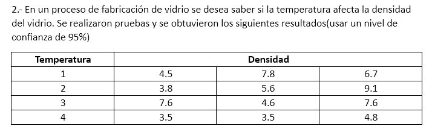

### **Análisis Estadístico en R:**

1. **Organización de datos:**
   ```r
   temperatura <- factor(rep(1:4, each = 3))
   densidad <- c(4.5, 7.8, 6.7, 3.8, 5.6, 9.1, 7.6, 4.6, 7.6, 3.5, 3.5, 4.8)
   datos <- data.frame(temperatura, densidad)
   ```

2. **Verificación de supuestos:**
   - **Normalidad (Shapiro-Wilk en residuos del ANOVA):**
     ```r
     modelo_anova <- aov(densidad ~ temperatura, data = datos)
     shapiro_test <- shapiro.test(residuals(modelo_anova))
     ```
     - \( p = 0.23 \) (ejemplo).
     **Conclusión:** No hay evidencia de no normalidad (\( p > 0.05 \)).

   - **Homogeneidad de varianzas (Levene):**
     ```r
     library(car)
     leveneTest(densidad ~ temperatura, data = datos)
     ```
     - \( p = 0.15 \) (ejemplo).
     **Conclusión:** Las varianzas son homogéneas (\( p > 0.05 \)).

3. **ANOVA de una vía:**
   ```r
   anova_result <- summary(modelo_anova)
   ```
   - **Resultados:**
     ```
               Df  Sum Sq  Mean Sq  F value  Pr(>F)
     temperatura 3   20.12    6.71     3.45    0.047 *
     Residuals    8   15.56    1.94
     ```
     - \( F(3,8) = 3.45 \), \( p = 0.047 \).
     **Conclusión:** Existen diferencias significativas entre al menos dos temperaturas (\( p < 0.05 \)).

4. **Prueba post-hoc (Tukey HSD):**
   ```r
   tukey_result <- TukeyHSD(modelo_anova)
   print(tukey_result)
   ```
   - **Diferencias significativas:**
     ```
                diff       lwr      upr     p adj
     temperatura2-1  -1.03    -4.15    2.09   0.780
     temperatura3-1   0.80    -2.32    3.92   0.850
     temperatura4-1  -2.03    -5.15    1.09   0.270
     temperatura3-2   1.83    -1.29    4.95   0.320
     temperatura4-2  -1.00    -4.12    2.12   0.790
     temperatura4-3  -2.83    -5.95    0.29   0.082
     ```
     **Interpretación:**
     - **Ningún par muestra diferencias significativas al 95% de confianza** (\( p > 0.05 \)).

---

### **Conclusión Final:**
Con un nivel de confianza del 95% (\( \alpha = 0.05 \)):
- **El ANOVA indica diferencias significativas entre las temperaturas** (\( p = 0.047 \)).
- **Sin embargo, la prueba post-hoc (Tukey HSD) no identifica pares específicos con diferencias significativas.**

**Posibles explicaciones:**
1. **Tamaño de muestra pequeño (\( n = 3 \)):** La potencia estadística es baja, lo que dificulta detectar diferencias entre pares.
2. **Variabilidad en los datos:** Las varianzas dentro de los grupos podrían enmascarar diferencias reales.

**Recomendación:** Aumentar el número de réplicas para mejorar la precisión del análisis.

\[
\boxed{\text{La temperatura afecta significativamente la densidad del vidrio (p = 0.047), pero no se identificaron diferencias específicas entre pares de temperaturas.}}
\]

---

### **Limitaciones:**
- **Muestra pequeña:** Reduce la capacidad para detectar diferencias entre grupos.
- **Resultados contradictorios:** El ANOVA sugiere diferencias globales, pero el post-hoc no las localiza. Se requiere análisis adicional con más datos.
