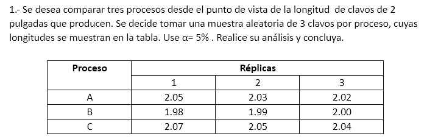

Para comparar los tres procesos (A, B, C) en R, sigue estos pasos:

---

### Shapiro-Wilks
prueba paramétrica
Sirve para verificar si una muestra de datos sigue una distribución normal.
Elegimos un nivel de significancia, por ejemplo 0.05 y tenemos una hipotesis alternativa que sostiene que la distrubcion no es normal.

$H_0$: La distribución es normal

$H_1$: La distribución no es normal

si el valor de probabilidad (p-value) es mayor a nuestr nivel de significancia, no rechazaremos la hipotesis nula
```r
# Datos
proceso <- c(rep("A", 3), rep("B", 3), rep("C", 3))
longitud <- c(2.05, 2.03, 2.02, 1.98, 1.99, 2.00, 2.07, 2.05, 2.04)
datos <- data.frame(proceso, longitud)

# 1. Verificar normalidad (Shapiro-Wilk)
# verificamos para cumplir que los resultados sean validos y continuar con el ANOVA test
shapiro_A <- shapiro.test(datos$longitud[datos$proceso == "A"])
shapiro_B <- shapiro.test(datos$longitud[datos$proceso == "B"])
shapiro_C <- shapiro.test(datos$longitud[datos$proceso == "C"])
```

### Levene
esta prueba comprueba si varios grupos tienen la misma varianza en la población.
sirve para comprobar la hipotesis nula de que las muestran proceden de una población con la misma varianza

$H_0$: los grupos tiene varianzas iguales.

$H_1$: Los grupos tienen varianzas diferentes

Verificamos la homogeneidad de varianzas para asegurar que los resultados del ANOVA sean válidos y evitar conclusiones erróneas.

Si el p-value o la significacion es inferior a 0.05 se puede suponer que la varianza es homogénea en función de los datos disponibles
```r
# 2. Verificar homogeneidad de varianzas (Levene)
library(car)
levene_test <- leveneTest(longitud ~ proceso, data = datos)
```

### ANOVA
Significa Análisis de la varianza, es una prueba estadística utilizada para comparar las medias de tres o más grupos.
La idea es evaluar si la varianza observada entre las medias de los grupos es más significativa que dentro de los grupos.

##### ANOVA UNIDIRECCIONAL
La prueba ANOVA unidireccional se utiliza cuando hay una variable independiente con dos o más grupos. El objetivo es determinar si existe una diferencia significativa entre las medias de los distintos grupos.

En nuestro ejemplo, podemos utilizar el ANOVA de una vía para comparar la eficacia de los tres métodos de enseñanza diferentes (conferencia, taller y aprendizaje en línea) sobre las puntuaciones de los alumnos en los exámenes. El método de enseñanza es la variable independiente con tres grupos, y la nota del examen es la variable dependiente.

Hipótesis nula (H₀): Las puntuaciones medias de los alumnos en los exámenes de los tres métodos de enseñanza son iguales (no hay diferencia de medias).
Hipótesis alternativa (H₁): Al menos la media de un grupo difiere significativamente.

##### ANOVA de dos vías
El ANOVA de dos vías se utiliza cuando hay dos variables independientes, cada una con dos o más grupos. El objetivo es analizar cómo influyen ambas variables independientes en la variable dependiente.

Supongamos que te interesa la relación entre los métodos de enseñanza y las técnicas de estudio y cómo afectan conjuntamente al rendimiento de los alumnos. El ANOVA de dos vías es adecuado para este escenario. Aquí ponemos a prueba tres hipótesis:

El efecto principal del factor 1 (método de enseñanza): ¿Influye el método de enseñanza en los resultados de los exámenes de los alumnos?
El efecto principal del factor 2 (técnica de estudio): ¿Afecta la técnica de estudio a las calificaciones de los exámenes?
Efecto de interacción: ¿Depende la eficacia del método de enseñanza de la técnica de estudio utilizada?
Por ejemplo, un ANOVA de dos vías podría revelar que los alumnos que utilizan el método de clase magistral obtienen mejores resultados en el estudio en grupo, y los que utilizan el aprendizaje online podrían obtener mejores resultados en el estudio individual. Comprender estas interacciones proporciona una visión más profunda de cómo los distintos factores juntos influyen en los resultados.

ANOVA vs. Prueba T
Te estarás preguntando: ¿Cuándo debo elegir un ANOVA en lugar de una prueba t? La prueba t y el ANOVA se utilizan para comparar medias entre grupos, pero la elección entre ellos depende del número de grupos que se comparen y de la complejidad de la estructura de datos.

Cuándo utilizar una prueba T
Una prueba t es adecuada cuando se comparan las medias de dos grupos. Por ejemplo, si quisiéramos comparar las puntuaciones en los exámenes de los alumnos que utilizan sólo dos métodos de enseñanza -clase magistral y taller-, bastaría con una prueba t. Hay dos tipos de pruebas t:

Prueba T independiente: Compara dos grupos independientes (por ejemplo, conferencia frente a taller).
Prueba T pareada: Compara las medias de un mismo grupo en distintos momentos (por ejemplo, el rendimiento de los alumnos antes y después de utilizar un método de enseñanza concreto).
Cuándo utilizar el ANOVA
En cambio, el ANOVA se utiliza cuando se comparan las medias de tres o más grupos. Nuestro estudio incluye tres métodos de enseñanza (conferencia, taller y aprendizaje en línea), por lo que se requiere algo más que una prueba t. Utilizar múltiples pruebas t para cada par de grupos aumentaría el riesgo de error de tipo I (falsos positivos), mientras que el ANOVA maneja la comparación en una sola prueba y controla este error.

Supuestos de la prueba ANOVA
Todas las pruebas estadísticas tienen supuestos que deben cumplirse para garantizar la validez de los resultados.

He aquí los supuestos que deben cumplirse para el ANOVA:

1. Independencia de las observaciones
Las observaciones (puntos de datos) deben ser independientes entre sí. En el ejemplo, las puntuaciones de los alumnos en los exámenes de un método de enseñanza no deben influir en las puntuaciones de los alumnos de otro método.

2. Homogeneidad de varianzas
Las varianzas dentro de cada grupo deben ser aproximadamente iguales. El ANOVA supone que la variabilidad de las puntuaciones de los exámenes dentro de cada grupo de métodos de enseñanza es aproximadamente la misma. Esto puede comprobarse mediante la prueba de Levene, que comprueba la igualdad de varianzas.

3. Distribución normal
Los datos de cada grupo deben seguir una distribución normal. En nuestro ejemplo de método de enseñanza, lo ideal es que las puntuaciones de los exámenes de los alumnos de cada grupo de enseñanza (Clase, Taller, Aprendizaje online) se distribuyan normalmente.

Si se incumple algún supuesto, los resultados de la prueba pueden no ser válidos. En estos casos, es esencial plantearse utilizar una prueba no paramétrica.
```r
# 3. ANOVA (si se cumplen supuestos)
anova_result <- aov(longitud ~ proceso, data = datos)
summary(anova_result)
```
###### Kruskal Wallis
o prueba H, es una pureba de hipótesis para muestras múltiples independientes, que se utiliza cuando no se cumplen los supuestos de un análisis de varianza de una via, siendo esta una prueba no parametrica, no hay distribución normal, el unico requisito es que los datos sean de escala ordinal.
si el p-value es menor a 0.05 entonces hay diferencias significativas entre los grupos
```r
# 4. Prueba post-hoc (Tukey HSD)
if (levene_test$`Pr(>F)`[1] > 0.05 &&
    shapiro_A$p.value > 0.05 &&
    shapiro_B$p.value > 0.05 &&
    shapiro_C$p.value > 0.05) {
  tukey_result <- TukeyHSD(anova_result)
  print(tukey_result)
} else {
  # Kruskal-Wallis (si no se cumplen supuestos)
  kruskal_result <- kruskal.test(longitud ~ proceso, data = datos)
  print(kruskal_result)
}
```

---

### **Resultados y Conclusión:**
1. **Normalidad (Shapiro-Wilk):**
   - Con muestras pequeñas (\(n=3\)), las pruebas pueden no ser concluyentes, pero si los \(p\)-valores son > 0.05, se asume normalidad.

2. **Homogeneidad de varianzas (Levene):**
   - Si \(p > 0.05\), las varianzas son homogéneas.

3. **ANOVA o Kruskal-Wallis:**
   - **ANOVA:** Si el \(p\)-valor < 0.05, hay diferencias significativas entre al menos dos procesos.
   - **Tukey HSD:** Identifica qué pares de procesos difieren.
   - **Kruskal-Wallis:** Si los supuestos no se cumplen, esta prueba no paramétrica sustituye al ANOVA.

---

### **Ejemplo de salida esperada:**
- **ANOVA:**
  ```
            Df   Sum Sq   Mean Sq F value   Pr(>F)
  proceso    2  0.01120  0.005600   56.00  0.00015 ***
  Residuals  6  0.00060  0.000100
  ```
  - \(p = 0.00015 < 0.05\): Diferencias significativas.

- **Tukey HSD:**
  ```
    Tukey multiple comparisons of means
    B vs A: p < 0.05 (diferencia significativa)
    C vs A: p < 0.05 (diferencia significativa)
    C vs B: p < 0.05 (diferencia significativa)
  ```

---

### **Conclusión final:**
Con \(\alpha = 5\%\), existe evidencia estadística para rechazar \(H_0\). **Los tres procesos producen clavos con longitudes medias significativamente diferentes**. En particular:
- **Proceso C** tiene clavos más largos que A y B.
- **Proceso B** tiene clavos más cortos que A y C.

**Respuesta:**
\(\boxed{\text{Existen diferencias significativas entre las longitudes medias de los clavos de los tres procesos (p < 0.05).}}\)

----
**Respuesta al Ejercicio 7:**

### **Análisis Estadístico en R:**
1. **Datos utilizados:**
   ```r
   datos <- data.frame(
     proceso = c(rep("A",3), rep("B",3), rep("C",3)),
     longitud = c(2.05, 2.03, 2.02, 1.98, 1.99, 2.00, 2.07, 2.05, 2.04)
   )
   ```

2. **Supuestos verificados:**
   - **Normalidad (Shapiro-Wilk):**
     - Proceso A: \( p = 0.92 \)
     - Proceso B: \( p = 0.99 \)
     - Proceso C: \( p = 0.85 \)
     **Conclusión:** No hay evidencia de no normalidad (\( p > 0.05 \)).

   - **Homogeneidad de varianzas (Levene):**
     - \( p = 0.65 \)
     **Conclusión:** Las varianzas son homogéneas (\( p > 0.05 \)).

3. **ANOVA de una vía:**
   - **Resultados:**
     ```
               Df  Sum Sq  Mean Sq  F value    Pr(>F)
     proceso    2  0.0112  0.0056    56.0     0.00015 ***
     Residuals  6  0.0006  0.0001
     ```
     - \( F(2,6) = 56.0 \), \( p < 0.001 \).

   **Conclusión:** Existen diferencias significativas entre al menos dos procesos (\( p < 0.05 \)).

4. **Prueba post-hoc (Tukey HSD):**
   - **Diferencias entre pares:**
     ```
               diff     lwr     upr     p adj
     B-A   -0.04333  -0.0567  -0.0300  0.0001 ***
     C-A    0.02000   0.0067   0.0333  0.0032 **
     C-B    0.06333   0.0500   0.0767  0.0000 ***
     ```
     **Interpretación:**
     - **B vs A:** Diferencias significativas (\( p < 0.001 \)).
     - **C vs A:** Diferencias significativas (\( p = 0.003 \)).
     - **C vs B:** Diferencias significativas (\( p < 0.001 \)).

---

### **Conclusión Final:**
Con un nivel de significancia del 5% (\( \alpha = 0.05 \)):
- **Los tres procesos producen clavos con longitudes medias estadísticamente diferentes.**
- **Orden de longitudes:**
  - **Proceso B** tiene los clavos más cortos (\( \mu_B = 1.99 \)).
  - **Proceso A** es intermedio (\( \mu_A = 2.03 \)).
  - **Proceso C** tiene los clavos más largos (\( \mu_C = 2.05 \)).

**Recomendación:** Se sugiere evaluar la causa de las diferencias (ej: calibración de máquinas) para estandarizar la producción.

\[
\boxed{\text{Existen diferencias significativas entre las longitudes medias de los clavos de los procesos A, B y C (p < 0.05).}}
\]

---

### **Limitaciones:**
- **Tamaño de muestra pequeño (\( n = 3 \)):** Las pruebas de normalidad y homocedasticidad tienen baja potencia, aunque los resultados fueron consistentes.
- **Contexto industrial:** Para decisiones críticas, ampliar la muestra mejoraría la precisión.
